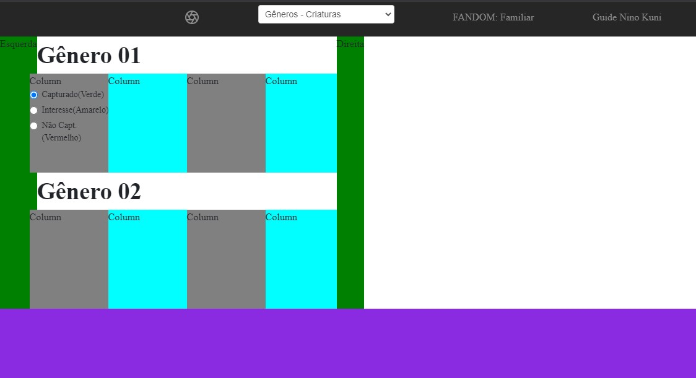
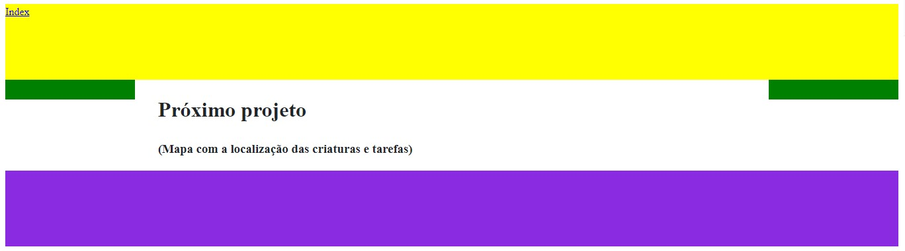

<h1 align="center">Ninokuni-Capture_FAMILIARS</h1>

<h4 align="center"> 
	🚧  🚀 Em construção...  🚧
</h4>

### 💻 Sobre o projeto
Uma Ferramenta simples em HTML para baixar ajudando visualmente o jogador a decidir quais criaturas capturar e a organizar o que já está capturado neste game.

Página simples criada com opções para que o jogador possa decidir o que fazer com cada "FAMILIARS" como:
>**opções "rádio"**
>> *VERDE=* A qual a criatura encontra-se capturada.   *AMARELO=* Para um interesse em capturar.   *VERMELHO=* Para aqueles que não deseja.

Cada imagem de criatura, clicando sob ela o mostrara suas evoluções.
 
### Características
- [x] Criar rascunho da página inicial.
- [x] Capturar as imagens das criaturas.
- [ ] Ajustar e fatias cada página das criaturas.
- [x] Background de fundo da página.
- [x] Background de fundo menu.
- [x] Background de fundo rodapé.
- [ ] Background de fundo para cada título.
- [ ] Imagens das criaturas.
- [ ] Ancora para cada título.
- [ ] Ajustes  de opções nas criaturas.
- [ ] Evoluções (Criar uma extensão ou página)
- [ ] Página de Localização (Próximo projeto).
- [ ] Rever as necessidades para os "Pré-requisitos"

### 19/04/2021 - Subindo o rascunho da página inicial
Página inicial com "barra de menu", "conteúdo no meio" com: barras laterais para criar um espaço, títulos para âncoras, retângulos que serão alterados por imagens com opções e no final da página o rodapé ainda não definido o que será.

### 20/04/2021 - Subindo a página de Localização
Página de rascunho para a sequência do projeto.

### Pré-requisitos
Há rever.